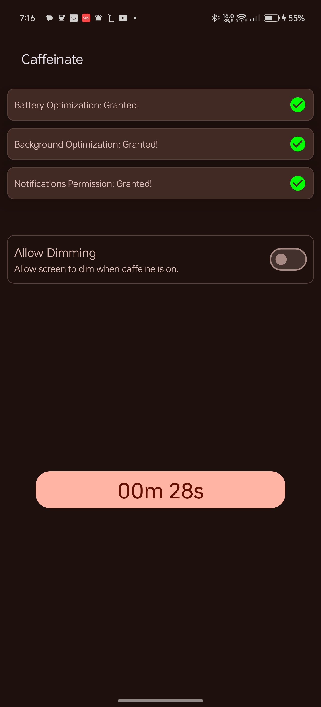
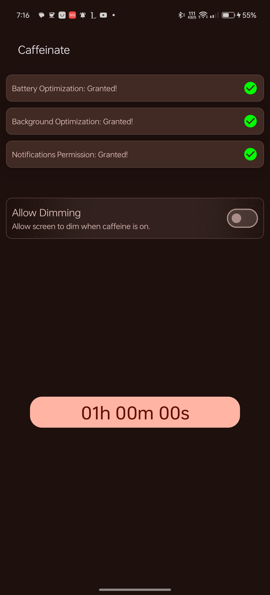
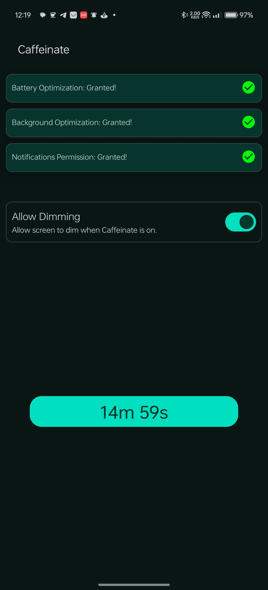
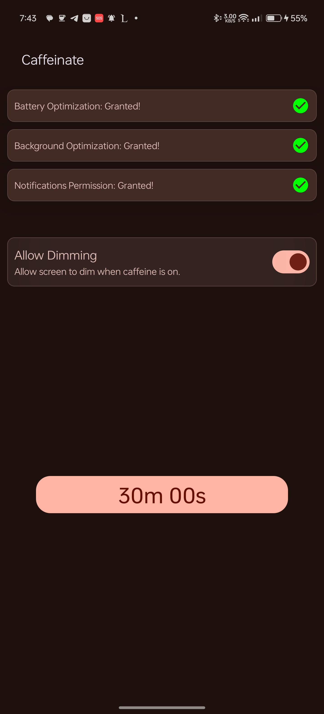
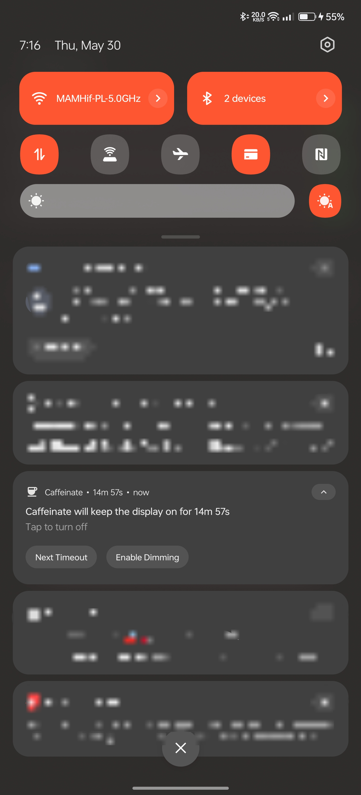
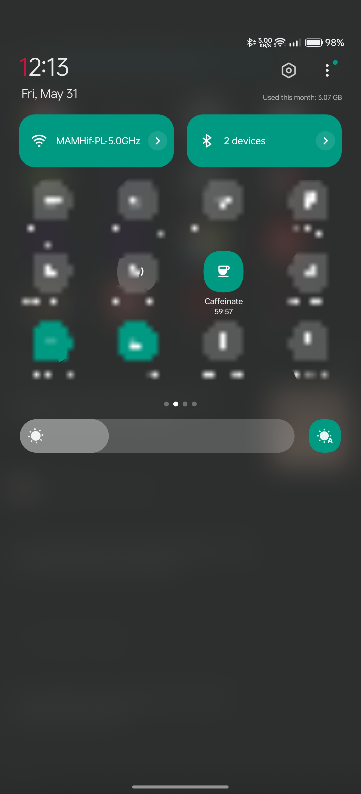

  

# Caffeinate

Caffeinate is an App that helps android developers Keep their phone's screen On while developing

# Screenshots

<table>
    <tr>
        <td>
            
        </td>
        <td>
            
        </td>
        <td>
            
        </td>
        <td>
            
        </td>
    </tr>
    <tr> 
        <td>
            
        </td>
        <td>
            
        </td>
        <td>
            
        </td>
        <td>
            
        </td>
    </tr>
</table>
