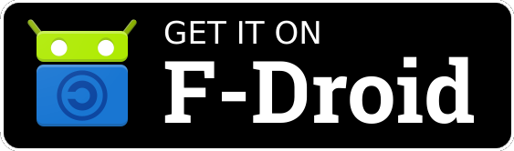

<!-- Project Header: Branding and short description -->

    

<h1 align="center">
    
    Caffeinate
</h1>

     A lightweight Android app that keeps your screen awake for a configurable duration, without changing system settings.

    

<!-- About: What the app does and when to use it -->

##  About

**Caffeinate** is a lightweight Android utility that keeps your device’s screen awake for a configurable duration, without changing system display or power settings. 

It is useful for situations where uninterrupted screen activity is required, such as development, testing, or following long instructions.

The app can be controlled in two ways:
- **Quick Settings tile** (Android 7.0+)
- **In-app control**

<!-- Features: What users get and why it matters -->

##  Features

- **Keep your screen awake when you need it**  
  Uses Android’s `WakeLock` to prevent unwanted screen timeouts.

- **Choose how bright your screen stays**  
  Supports both dim and bright screen modes.

- **Flexible timeout options**  
  Select from preset durations:
  - 30 seconds  
  - 5, 10, 15, 30, 60 minutes  
  - Infinite

- **Quick and simple control**  
  Change or stop timeouts directly from the Quick Settings tile or inside the app.

- **Instant stop**  
  Tap again at any time to immediately end the active timeout.

- **Works across screen locks**  
  Optionally keep the screen active after unlocking the device.

- **Safe by default**  
  The `WakeLock` is released automatically when the screen is locked.

- **Looks the way you want**  
  Light, Dark, System default, and Material You themes are supported.

<!-- Screenshots: Visual overview of the app UI -->

##  Screenshots

    
    
    
    
     
    
    
    
    

More screenshots

    
    
    
    
    
    
    
    

<!-- Download: Installation options -->

##  Download

Caffeinate can be installed using the options below.  
Choose the method that best fits your update preferences.  

### Recommended

  

Install via **Obtainium** to receive automatic updates directly from GitHub releases, without relying on centralized app stores.

---

### Other Installation Options

  
  

  
  

>**Note**  
> The Google Play version is currently in testing.  
> To join the beta program, please contact the maintainer.

<!-- Translations: Localization workflow and contribution -->

##  Translations

Caffeinate is localized using **Crowdin**, which manages both in-app text and app store descriptions:  

https://crowdin.com/project/caffeinate

### How translations work
- All translations are reviewed before being included.
- New languages and updates are approved to maintain quality and consistency.

### Contribute a translation
- Request a new language or apply as a translator on Crowdin:  
  https://crowdin.com/profile/abdalmoniem
- Or open a GitHub issue to discuss translation-related requests.

This process ensures accurate, high-quality translations while keeping contributions simple and transparent.

<!-- License: Legal information -->

##  License

Caffeinate is licensed under the **GNU General Public License v3.0**.  
See the [LICENSE](LICENSE) file for details.
