<!--suppress CheckImageSize, HtmlDeprecatedAttribute -->

    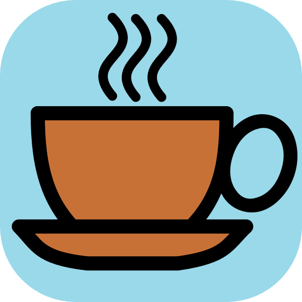
    <h1>💊 Caffeinate</h1>
    
Caffeinate Keeps the phone's screen awake for a configurable amount of time.

# ❓ About

Caffeinate is an App that helps android developers to keep their phone's display awake without having
to change the device settings. It can be toggled at various places:

* A `tile` in the quick settings, the place that holds the toggles for e.g. Wi-Fi and Bluetooth. Requires
  Android 7 or higher.
* A `button` in the app itself

# 💪 Features

* Uses android's `WakeLock` Class with either `SCREEN_DIM_WAKE_LOCK` or `SCREEN_BRIGHT_WAKE_LOCK` lock
  level based on user settings
* Timeout period is configurable
* Switch timeouts from the `quick settings tile` or the `button` in the app. clicking them, selects the
  next timeout and after `1 second` the timeout will start, if the `quick settings tile` or the `button`
  are clicked after starting, the timeout will stop.
* Available timeouts are `[30 seconds, 05 minutes, 10 minutes, 15 minutes, 30 minutes, 60 minutes, ∞]`
* An option to enable the screen to dim while the `WakeLock` is acquired
* An option to enable holding the `WakeLock` if the screen is locked, so that the screen will keep on
  after unlocking, default behaviour is that the `WakeLock` is released when the screen is locked
* Multiple theming options `[light, dark, system default and material you]`

     
    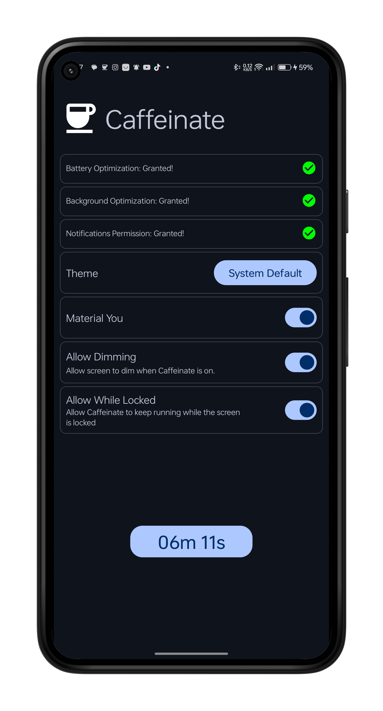
    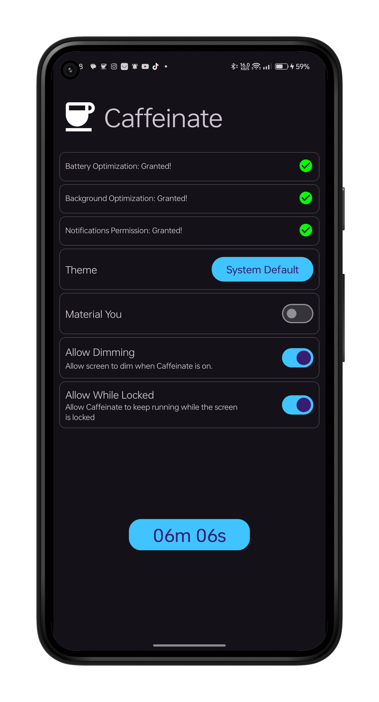
    
    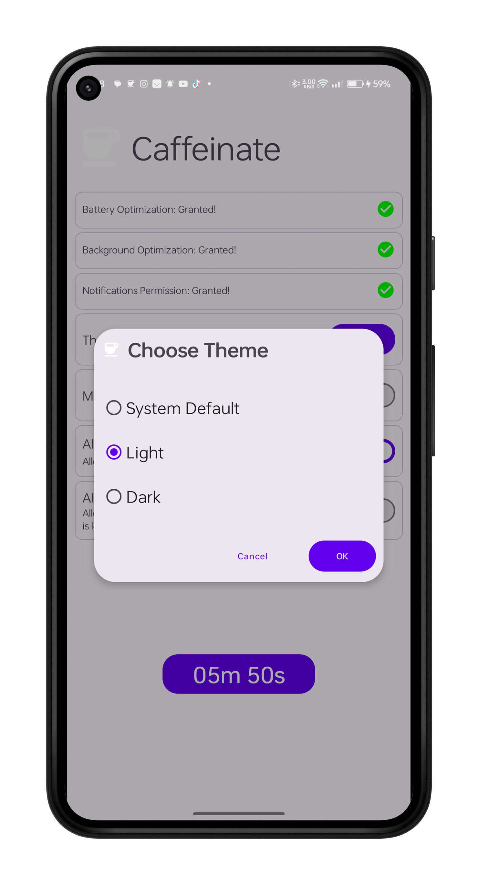
    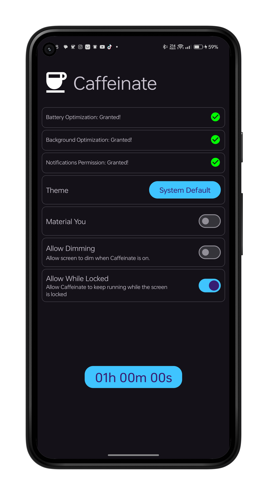
    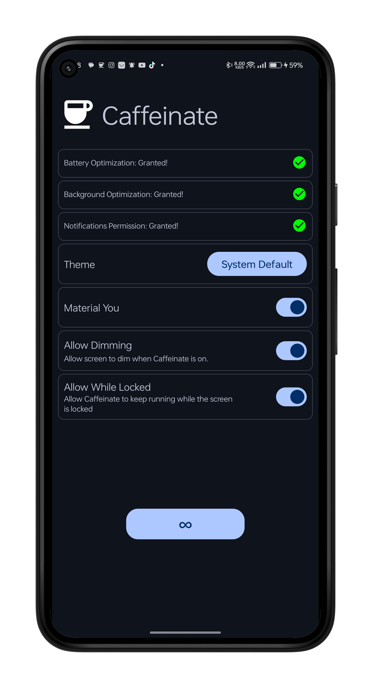
    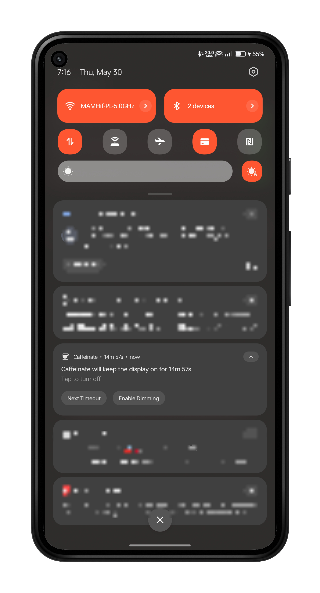
    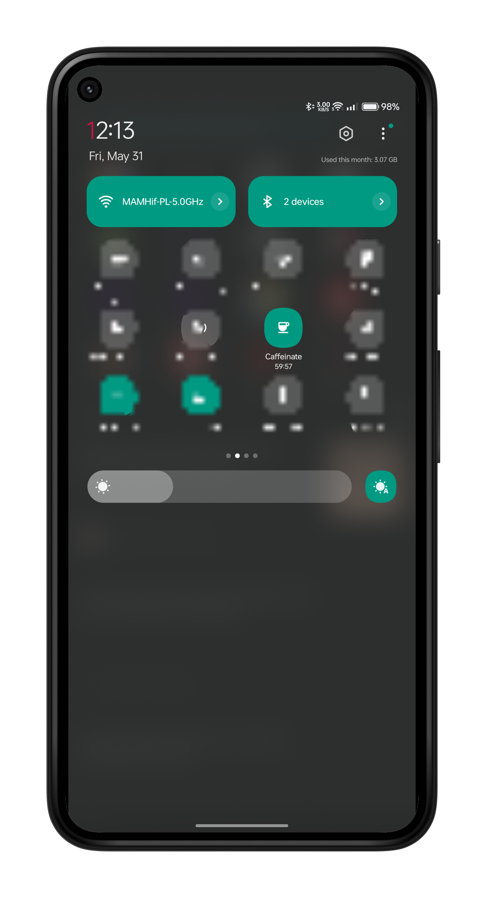
    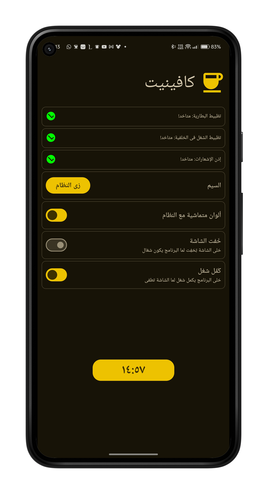
    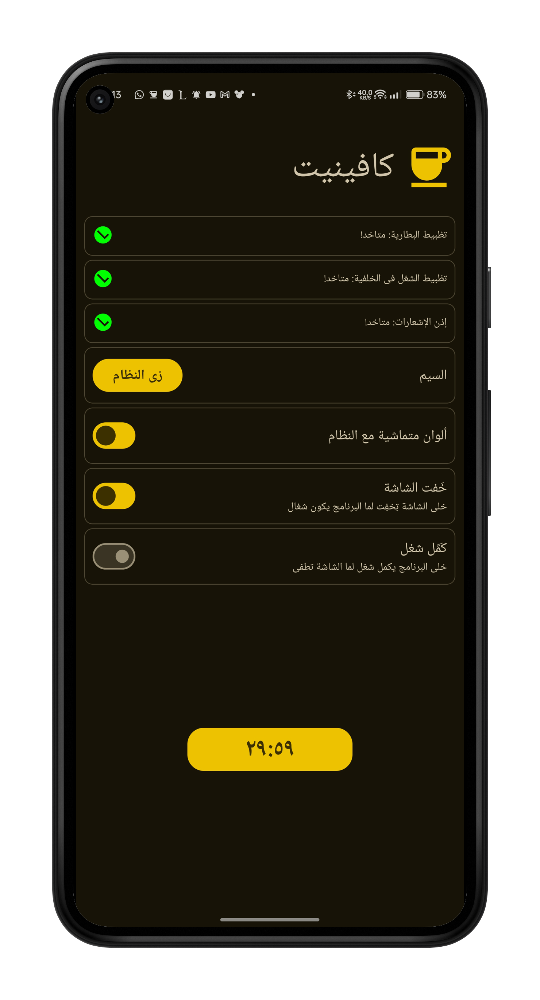
    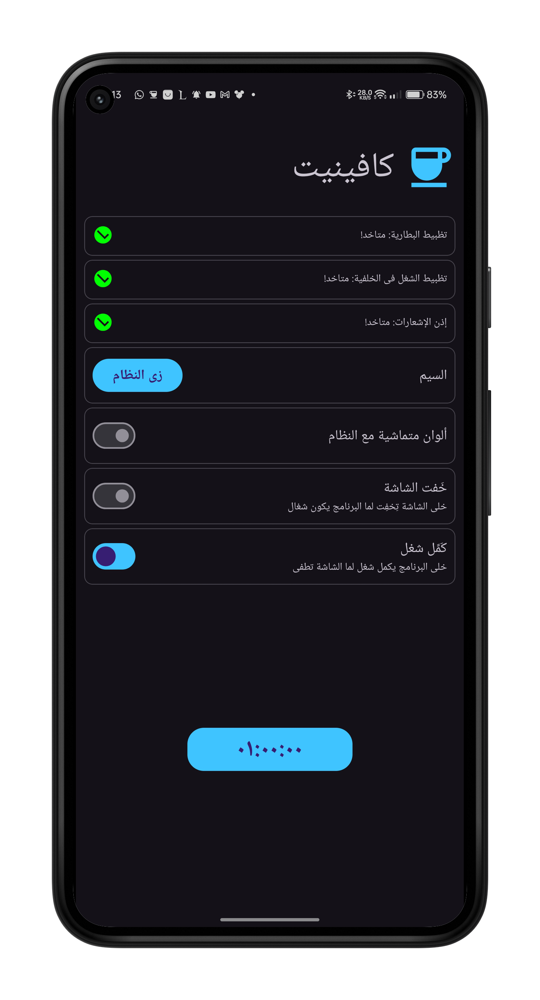
    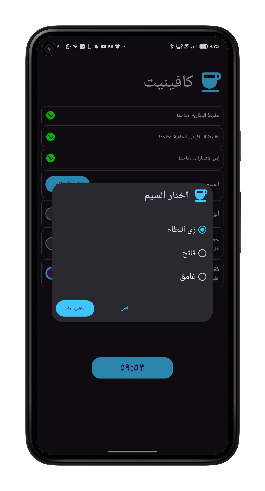
    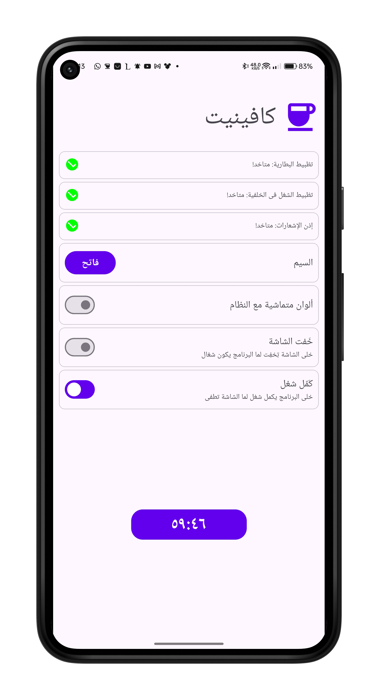
    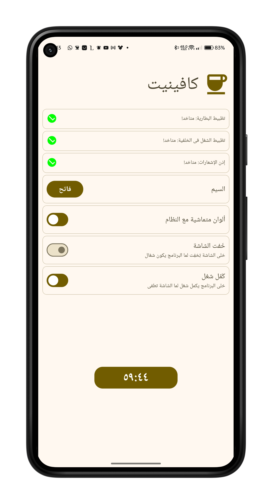
    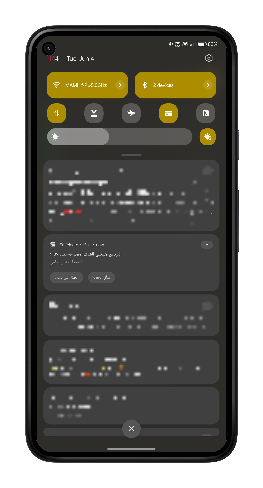
    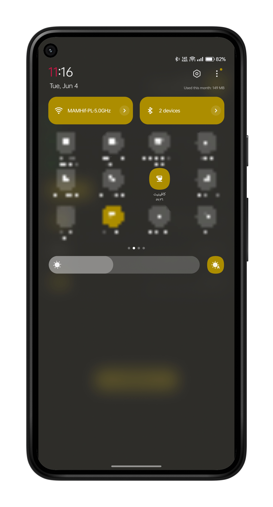

# 🔽 Download

For now, you can download the most recent version of Caffeinate
from [GitHub Releases](https://github.com/abdalmoniem/Caffeinate/releases/latest).

[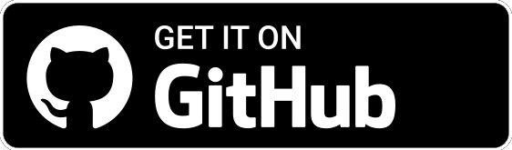](https://github.com/abdalmoniem/Caffeinate/releases/latest)
[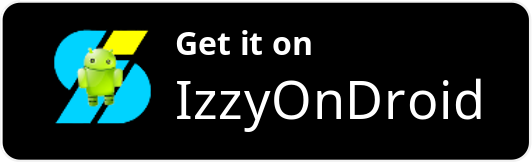](https://apt.izzysoft.de/fdroid/index/apk/com.hifnawy.caffeinate)

## 🈵 Translations

App strings and the app store description can be translated via
Crowdin: https://crowdin.com/project/caffeinate

Translations have to be approved before being merged into the app. To become a translator with approval
rights or to request a new language, please [poke me on Crowdin](https://crowdin.com/profile/abdalmoniem)
or open an issue here on GitHub.
